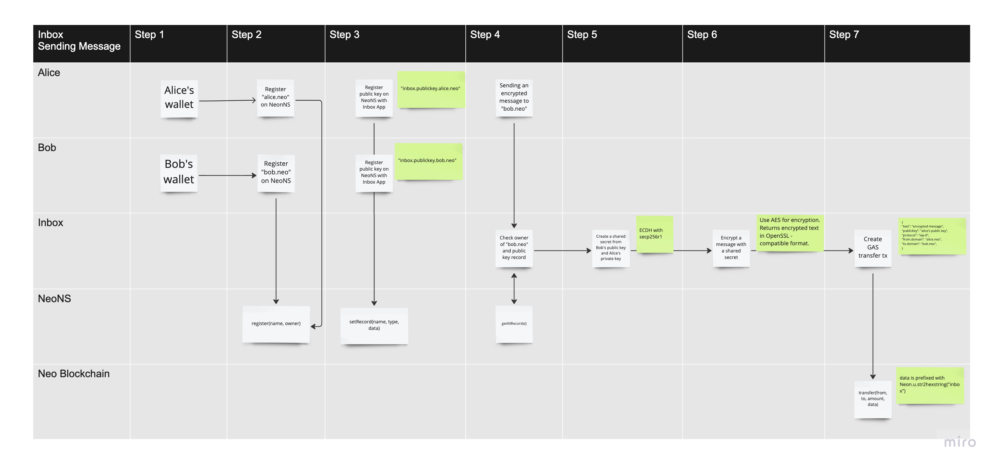
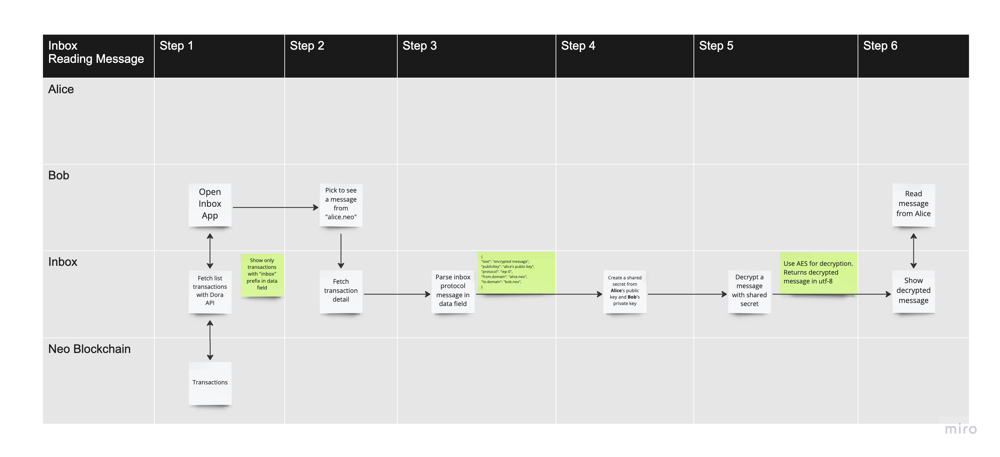
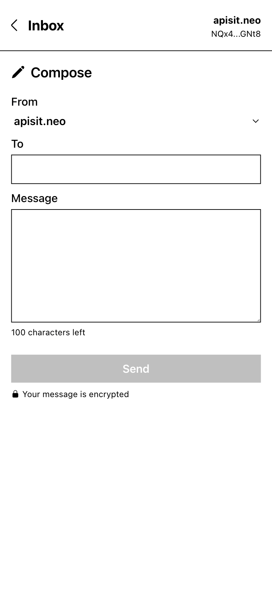
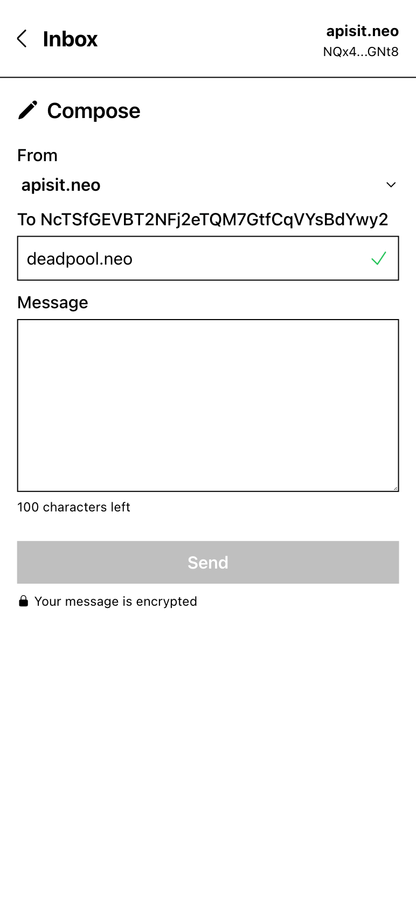
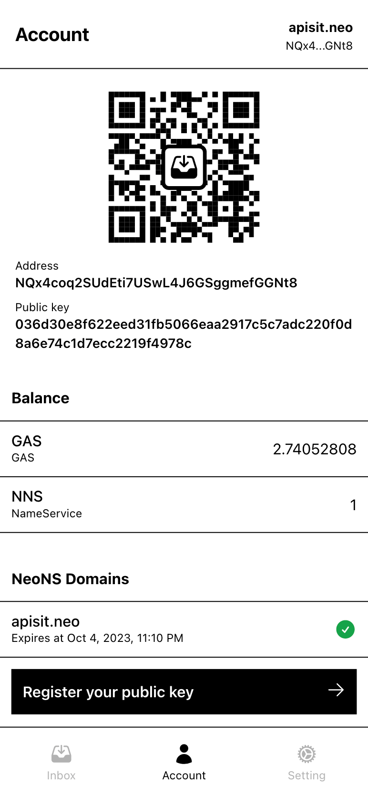
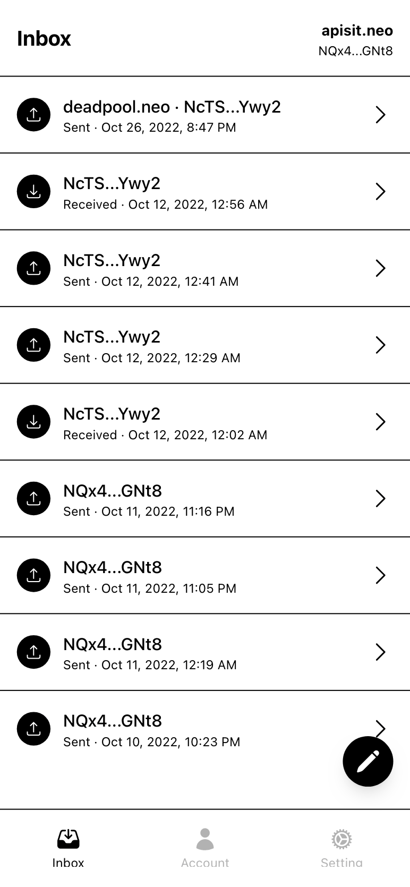
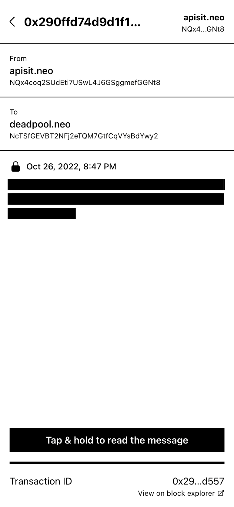
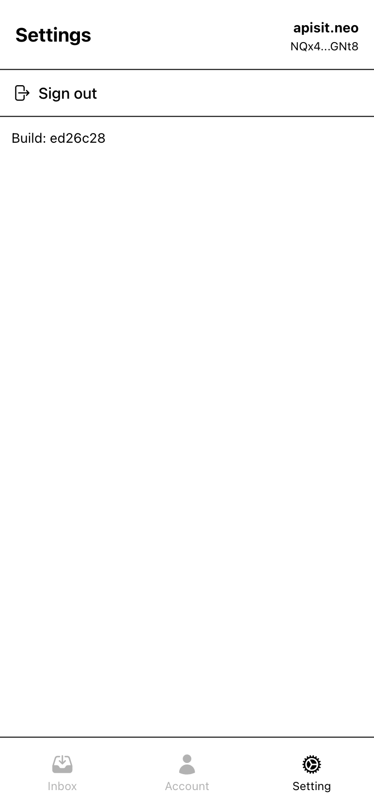

# inbox 
Send end-to-end encrypted message to another Neo address on Neo blockchain.

This project is built for educational purposes. It requires you to put your WIF inside the app. It's not able to connect via other connection methods such as WalletConnect, or dAPI yet.
Your WIF is stored locally using `localStorage` and never leave your computer or your phone. You can choose to log out at any time. It will remove your WIF from `localStorage`.

## Demo
Your inbox
https://dinbox.app

Twitter like public timeline with your NeoNS domain
https://dinbox.app/@apisit.neo


## What it can do
- You can send an encrypted message to any Neo N3 address that has NeoNS's `.neo` domain.
- Post on your public timeline

## Under the hood
Inbox uses ECDH — Your private key and recipient's public key are used to create a shared secret to encrypt a message with AES. Your public key is sent along with a transaction so a recipient can use it to create a shared secret to decrypt your message.

Inbox uses NeoNS as a decentralized public key server for key exchange mechanism. 
Your encrypted message is a `data` attached to a NEP-17 transfer transaction. See sample of a transaction [here](https://dora.coz.io/transaction/neo3/mainnet/0x290ffd74d9d1f163a9f32777cc9a52dd4b3b8c611426030a81d99e403fc0d557).


Here is a message protocol and a sample code
```
let inboxProtocolStruct =  
{
    "text": "",
    "publicKey": "",
    "protocol": "iep-0",
    "fromDomain": ""
    "toDomain": "",
}

let prefixHex = Neon.u.str2hexstring("inbox")
//add prefix to data field so we can catch it later.
let data = prefixHex + Neon.u.str2hexstring(JSON.stringify(inboxProtocolStruct))

```

## Technologies and libraries
This project uses the following underlying technologies and libraries.
- [ECDH](https://en.wikipedia.org/wiki/Elliptic-curve_Diffie%E2%80%93Hellman)
- [AES](https://en.wikipedia.org/wiki/Advanced_Encryption_Standard)
- [NeoNS](https://neo.link/)
- [neon-js](https://github.com/CityOfZion/neon-js)
- [tailwindcss](https://tailwindcss.com/)


## Flows


## Screenshots








## Install
`npm install`

## Run
`npm run start`


## Build
`npm run build`